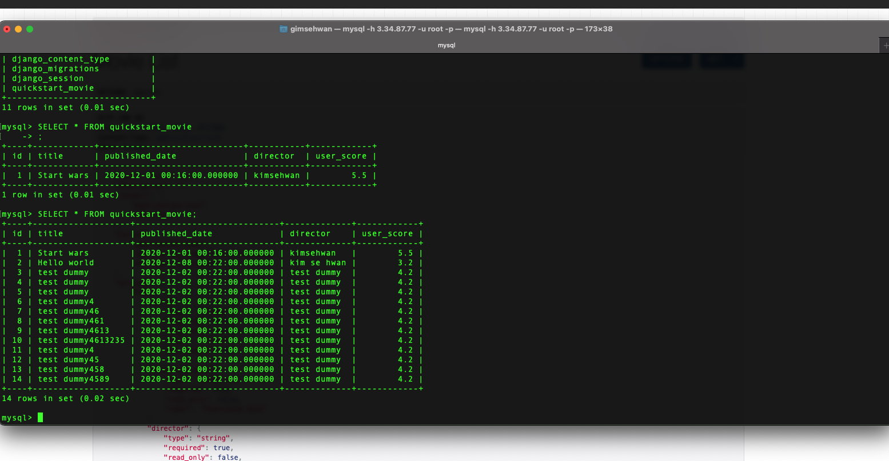

# Djnago를 이용한 RESTful API 구축

- 이 프로젝트를 위한 가상환경 생성 (venv)
    - `virtualenv venv --python=python3`

- `python3 -m pip install django`
- `python3 -m pip install djangorestframework`
- `python3 -m pip install django-filter`


### 데이터베이스와 sync하는 코드
`python3 manage.py migrate`

### admin 계정 생성
`python3 manage.py createsuperuser --email {자기이메일} --username admin`

### Serializer
- 첫번째 단계로, serializer를 정의한다.
- 새로운 모듈 이름인 tutorial/quickstart/serializers.py 를 생성한다.

```python3
from django.contrib.auth.models import User, Group
from rest_framework import serializers

class UserSerializer(serializers.HyperlinkedModelSerializer):
    class Meta:
        model = User
        fields = ['url', 'username', 'email', 'groups']
    
class GroupSerializer(serializers.HyperlinkedModelSerializer):
    class Meta:
        model = Group
        fields = ['url', 'name']
```

- 우리는 hyperlinked 관계를 `HyperlinkedModelSerializer`를 이용해 사용한다.
- 기본키와 다른 여러 관계들을 사용 할 수 있다.
- 하지만 hyperlinking은 아주 좋은 RESTful 설계이다.

### Views

- 간단한 view를 생성해보자.
- tutorial/quickstart/views.py를 다음과 같이 수정한다.

```python3
from django.contrib.auth.models import User, Group
from rest_framework import viewsets
from rest_framework import permissions
from tutorial.quickstart.serializers import UserSerializer, GroupSerializer


class UserViewSet(viewsets.ModelViewSet):
    """
    API endpoint that allows users to be viewed or edited.
    """
    queryset = User.objects.all().order_by('-date_joined')
    serializer_class = UserSerializer
    permission_classes = [permissions.IsAuthenticated]


class GroupViewSet(viewsets.ModelViewSet):
    """
    API endpoint that allows groups to be viewed or edited.
    """
    queryset = Group.objects.all()
    serializer_class = GroupSerializer
    permission_classes = [permissions.IsAuthenticated]

```

- 장고에서 view는 특정 URL로 요청이 들어왔을때 처리하는 로직이 들어간다. 아마 이게 RESTAPI의 중요한 파트이지 않을까,,

### URLs

- API URL을 셋업한다. `tutorial/urls.py`에 존재한다.

```python3
from rest_framework import routers
from django.urls import path, include
from tutorial.quickstart import views

router = routers.DefaultRouter()
router.register(r'users', views.UserViewSet)
router.register(r'groups', views.GroupViewSet)

urlpatterns = [
    path('', iuclude(router.urls)),
    path('api-auth/', include('rest_framework.urls', namespace='rest_framework')),
]
```

- views대신 viewsets를 사용했기 떄문에, 우리는 자동으로 API를 위한 URL conf를 생성 할 수 있다.
    - viewsets를 라우터 클래스에 register 하는 것으로 충분하다.

- 다시, 만약 API URLs위에사 추가적인 조작이 필요하다면, 간단하게 regular class-based view들을 drop down 함으로서 해결 가능하다.
    - 그리고 URL conf를 명시해주면 된다.

- 마지막으로 우리는 디폴트 Login, logout 뷰 API를 추가했다.

### 페이지네이션

- 페이지네이션은 한번의 요청에 얼마나 많은 오브젝트를 리턴해줄지 결정할 수 있다
- 이거 가능하게 하려면 `tutorials/settings.py` 에 아래 라인을 추가한다.

```python3
REST_FRAMEWORK = {
    'DEFAULT_PAGINATION_CLASS': 'rest_framework.pagination.PageNumberPagination',
    'PAGE_SIZE': 10
}
```

### Setting
- `rest_framework` 를 INSTALLED_APPS 에 추가 (setting)

```python3
INSTALLED_APPS = [
    ...
    'rest_framework',
]
```


- restapi 준비 완료!

` curl -H 'Accept: application/json; indent=4' -u admin:1234 http://127.0.0.1:8000/users/`

- 결과 :
```json
{
    "count": 2,
    "next": null,
    "previous": null,
    "results": [
        {
            "url": "http://127.0.0.1:8000/users/2/",
            "username": "kimsehwan",
            "email": "example@email.com",
            "groups": []
        },
        {
            "url": "http://127.0.0.1:8000/users/1/",
            "username": "admin",
            "email": "sehwan.kim@ingkle.com",
            "groups": []
        }
    ]
}
```

- 이 데이터는 django 디폴트 테이블에 저장된다.


## 이제 내가 실습해보자!

- movie라는 모델을 만들고 이친구를 CRUD 하는 API를 만들어보자구

### 첫번째 -> 앱 models.py에 모델 등록

- quickstart/models.py

```python3
from django.db import models

class Movie(models.Model):
    title = models.CharField(max_length=100)
    published_date = models.DateTimeField(auto_now=False)
    director = models.CharField(max_length=50)
    user_score = models.FloatField(default=0)

    def __str__(self):
        return "title : {}".format(self.title)
```

- Movie에 대한 클래스를 정의해준다.

### 두번째 -> serializers.py 에 MovieSerializer 등록

```python3
from django.contrib.auth.models import User, Group
from rest_framework import serializers
from .models import Movie

class MovieSerializer(serializers.HyperlinkedModelSerializer):
    class Meta:
        model = Movie
        fields = ['title', 'published_date', 'director', 'user_score']
```

- model은 Movie라고 명시하고, Movie 클래스 또한 import 해야 함
- Serialize(직렬화)할 필드들을 명시해준다.


### 세번째 -> views.py 에 ViewSet 클래스 정의

- views.py에 MovieViewSet 이라는 새로운 클래스를 정의한다.

```python3
from django.contrib.auth.models import User, Group
from rest_framework import viewsets
from rest_framework import permissions
from tutorial.quickstart.serializers import UserSerializer, GroupSerializer, MovieSerializer
from .models import Movie

class UserViewSet(viewsets.ModelViewSet):
    """
    API endpoint that allows user to be viewed or edited : 권한 설정
    """
    queryset = User.objects.all().order_by('-date_joined')
    serializer_class = UserSerializer
    permissions_classes = [permissions.IsAuthenticated]

class GroupViewSet(viewsets.ModelViewSet):
    """
    API endpoint that allows groups to be viewed or edited.
    """
    queryset = Group.objects.all()
    serializer_class = GroupSerializer
    permission_classes = [permissions.IsAuthenticated]

class MovieViewSet(viewsets.ModelViewSet):
    queryset = Movie.objects.all()
    serializer_class = MovieSerializer

```

### 네번째 urls.py 수정 -> router에 register 해야하며, basename을 명시한다.

```python3
from rest_framework import routers
from django.urls import path, include
from tutorial.quickstart import views

router = routers.DefaultRouter()
router.register(r'users', views.UserViewSet)
router.register(r'groups', views.GroupViewSet)
router.register(r'movies', views.MovieViewSet, basename="movies")

# 자동으로 URL 라우팅을 우리의 API와 연결해준다
# 로그인 Urls를 추가]
urlpatterns = [
    path('', include(router.urls)),
    path('api-auth/', include('rest_framework.urls', namespace='rest_framework')),
]
```

- 위와 같이 basename을 명시하지 않으면 migrate 할 때 이슈 발생

### 데이터베이스 마이그레이션 !

`python3 manage.py migrate`
`python3 manage.py makemigrations quickstart`

마이그레이션하고 API 테스트하면 끝 !


- 위와 같이 새로 추가된 /movies 엔드포인트 확인 가능하다 이말씀.
    - get 액션의 경우 페이지네이션 적용되었기 떄문에 next 정보까지 넘겨준다.



- 데베에서도 확인 가능 !


### 이렇게나 간단하게 CRUD가 구현되었는데, 응용을 하기 위해서 테스트를 해볼것이 많을 듯 하다.

## 남은 과제
- 실제 서버 배포는 어떻게 할까? 일반적인 django 프로젝트 배포와 동일할까?